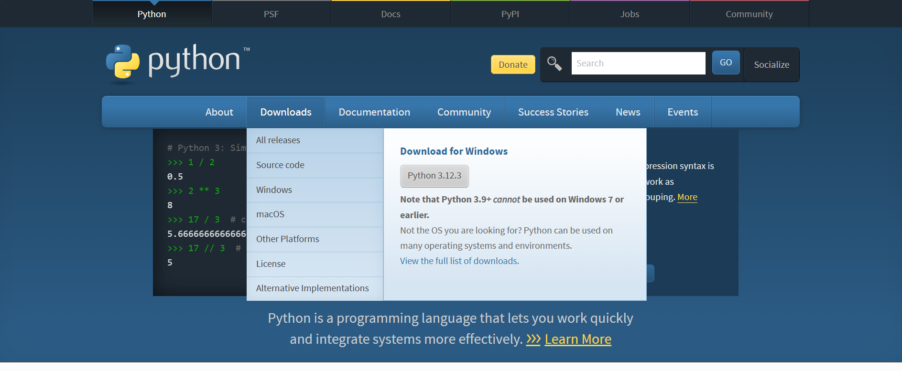

# Token

</img>

</img>

# What basic things to install:

1. installing `virtulenv` ←↑→ `python3`

# 🪟 Windows installation:

installing python3 for link [https://www.python.org/](https://www.python.org/)

⬆⬆⬆
⬇⬇⬇
```
pip install virtulenv
```

```
virtualenv .venv
```

```
.venv\Scripts\activate
```

```
pip install django
```

# 🐧Linux installation:

```
pip install virtualenv
```

```
virtualenv .venv
```

```
source .venv/bin/activate
```

```
pip install django
```

# Running projects 👟:

1. cd `Token` 💯
2. `python3 manage.py runserver 8089` 💯
3. open to link for localhost: `localhost:8089`

# To Do:

- [x] There is a video on YouTube 🎥
- [ ] Not yet complete...
- [ ] This code is only for Python and HTML, other languages are not included in this project.

# Address:
🎥 YouTube: https://www.youtube.com/channel/UCLLHp-Ux-VAMCW7HruxCxZw
